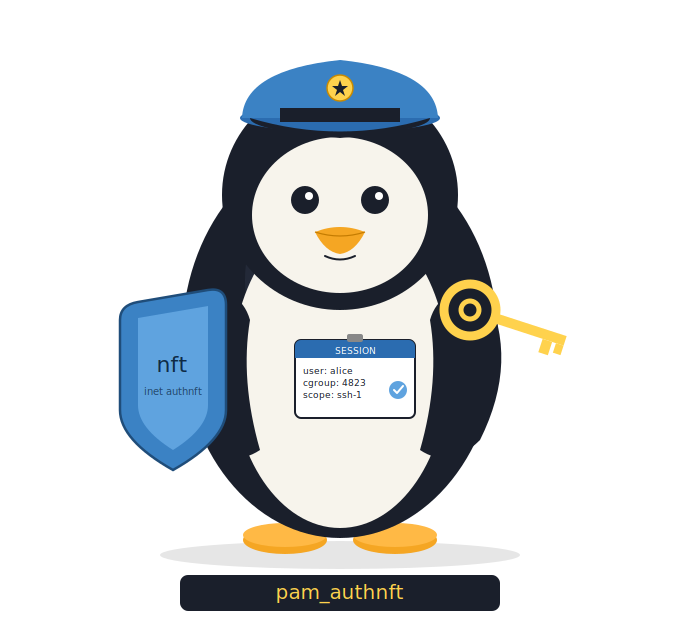

# pam_authnft

[](https://github.com/identd-ng/pam_authnft/actions/workflows/build.yml)
[](https://github.com/identd-ng/pam_authnft/actions/workflows/cppcheck.yml)
[](https://github.com/identd-ng/pam_authnft/actions/workflows/codeql.yml)
[](https://github.com/identd-ng/pam_authnft/actions/workflows/sanitizers.yml)
[](https://www.bestpractices.dev/projects/12496)
[](https://scan.coverity.com/projects/pam_authnft)
[](https://en.wikipedia.org/wiki/C_(programming_language))
[](LICENSE)

Linux has no built-in way to bind packet filter rules to an authenticated
user session and revoke them atomically at logout. pam_authnft fills that gap.

OpenBSD's pf has had this for years — named anchors loaded per-session via
pfctl, torn down when the session ends. pam_authnft brings the same model
to Linux: nftables named sets serve as the anchor equivalent, and the
cgroupv2 inode of a systemd transient scope replaces the authenticated shell
as the session identity. No dedicated shell, no setuid binary, no kernel
patches.

<p align="center">
  
</p>

> **Status: alpha (0.0.x).** The PAM interface (two exported symbols),
> nftables set schema, and fragment format are intended to be stable. The
> `claims_env` wire format, `rhost_policy=kernel` NETLINK details, and
> slice defaults may change before 1.0. See [Stability and
> roadmap](#stability-and-roadmap) below.

## Use cases

pam_authnft works with any PAM-enabled service. The scenarios where it
matters most:

- **SSH servers** — per-session firewall policy without wrapper scripts or
  ForceCommand hacks. A user's fragment can restrict outbound ports,
  pin allowed destinations, or enable masquerade only for that session.
- **VPN concentrators** (WireGuard, OpenConnect, strongSwan) — per-tunnel
  packet filtering tied to the VPN's PAM authentication, not a static
  ruleset that applies to all tunnels.
- **Bastion / jump hosts** — auditable per-session network access. Each
  session element is visible in `nft list set inet authnft session_map_ipv4`
  with username, PID, and optional claims tag, plus a shared correlation
  token in the systemd journal for SIEM join.
- **RADIUS / TACACS+ and OIDC deployments** — the `claims_env` mechanism
  can carry AAA attributes or token-derived claims from an upstream PAM
  module into the nftables element comment, creating a traceable link
  between the authentication decision and the firewall rule.
- **Container and VM orchestrators** — session-scoped network policy at
  the PAM layer, using the same cgroupv2 identity that systemd resource
  controls already understand.

## How it works

The cgroupv2 filesystem assigns each cgroup directory a unique inode, stable
for the cgroup's lifetime. When systemd creates a transient `.scope` for
the session via D-Bus, all session processes land under that cgroup. The
module reads the inode via `stat(2)` and inserts `{ inode . src_ip }` into
a named nftables set. At packet classification time, `meta cgroup` matches
the socket's originating cgroup against the set — binding the firewall rule
to the session without referencing PIDs, UIDs, or usernames.

Session policy is inspectable with standard `nft` tooling
(`nft list table inet authnft`); no `bpftool` or BPF program inspection
required.

On session open:

1. Normalises `PAM_RHOST`: IPv4/IPv6 literals pass through, zone suffixes
   stripped, hostnames handled per `rhost_policy` (see [Module
   arguments](#module-arguments)).
2. Locks the PAM process with a seccomp-BPF allowlist (`SCMP_ACT_KILL`
   default).
3. Creates a named transient `.scope` under `authnft.slice` via D-Bus.
4. Reads the scope's cgroupv2 inode via `stat(2)` and stores it in PAM data
   alongside the normalised source IP and a correlation token.
5. Validates and loads the user's root-owned fragment at
   `/etc/authnft/users/<username>`.
6. Inserts a session element into one of three named sets:
   - `session_map_ipv4` — `{ cgroup_id . src_ip }` when PAM_RHOST parsed
     as IPv4
   - `session_map_ipv6` — `{ cgroup_id . src_ip }` when PAM_RHOST parsed
     as IPv6
   - `session_map_cg`   — `{ cgroup_id }` only, when PAM_RHOST was absent
     or could not be normalised (default `rhost_policy=lax` behaviour)
7. Writes `/run/authnft/sessions/<cg_id>.json` (0644 root:root) so
   unprivileged observers can correlate the cgroup back to the owning
   session — see [docs/INTEGRATIONS.txt](docs/INTEGRATIONS.txt) §5.6.
8. Emits a structured `AUTHNFT_EVENT=open` journal entry with the
   correlation token — see [docs/INTEGRATIONS.txt](docs/INTEGRATIONS.txt)
   §6.2.

On logout the stored cgroup ID is retrieved from PAM data, the element is
deleted from the exact set it was inserted into, the session-identity JSON
is unlinked, and a matching `AUTHNFT_EVENT=close` journal entry is emitted
with the same correlation token. The nftables table and sets persist across
sessions.

For the full lifecycle, trust model, and seccomp details, see
[docs/ARCHITECTURE.txt](docs/ARCHITECTURE.txt).

## Integration surface

pam_authnft is deliberately small and composable. It exposes six stable
interfaces; the [integration contracts](docs/INTEGRATIONS.txt) document
each one with MUST/SHOULD requirements and versioning guarantees.

| Interface | What it is | Who cares |
|---|---|---|
| **PAM** | Exactly two exported symbols: `pam_sm_open_session`, `pam_sm_close_session`. Reads `PAM_USER`, `PAM_RHOST`, and optionally two env vars (`claims_env=NAME`, `AUTHNFT_CORRELATION`). | PAM module authors, distro packagers |
| **nftables sets** | Three named sets in `table inet authnft` (`session_map_ipv4`, `session_map_ipv6`, `session_map_cg`), inspectable via `nft list`. | Firewall tooling, policy engines |
| **Per-user fragments** | Plain nftables syntax at `/etc/authnft/users/<user>`. May use `include` to compose shared group-level rules (§4.6). | Config management (Ansible/Salt/Puppet), identity brokers |
| **systemd** | Transient `.scope` units under `authnft.slice`. Discoverable via `systemctl list-units 'authnft-*.scope'`. All `systemd.resource-control(5)` directives available. | Orchestrators, resource-accounting tools |
| **claims_env** | Optional keyring-payload channel: an upstream PAM module writes a tag via `add_key(2)` + `pam_putenv(3)`; pam_authnft reads, sanitizes, and embeds it in the nftables element comment. | AAA/audit integrations, identity brokers |
| **Session JSON + journal events** | `/run/authnft/sessions/<cg_id>.json` for observability (§5.6); `AUTHNFT_EVENT=open/close` journald records with a shared `AUTHNFT_CORRELATION` token (§6.2). | SIEM collectors, workload schedulers, operator dashboards |

The module is not a plugin host. There is no shared-library ABI, no
callback registry. Every contract uses an existing kernel or userspace
primitive (PAM env, kernel keyring, filesystem, D-Bus, netlink, journald)
with a narrow schema.

## Quick start

### Requirements

- Linux kernel >= 5.10, cgroupv2 unified hierarchy
- systemd with D-Bus
- nftables >= 1.0 (`meta cgroup` match requires kernel >= 4.19)
- Build: `gcc`, `make`, `pkg-config`
- Libraries: `libnftables`, `libseccomp`, `libsystemd`, `libcap`, `pam`

### Build and install

```
make                # release build
make debug          # rebuild with -DDEBUG -g for stderr tracing
make man            # build pam_authnft(8) manpage (requires pandoc)
sudo make install   # installs pam_authnft.so, authnft.slice, tmpfiles.d
sudo make install-man
```

Installs the module to `/usr/lib/security/pam_authnft.so`, `authnft.slice`
to `/etc/systemd/system/`, and the tmpfiles.d snippet that creates
`/run/authnft/sessions/` at boot to `/usr/lib/tmpfiles.d/authnft.conf`.

### Minimal working configuration

```bash
# Create the authnft group (members are subject to session firewall rules)
sudo groupadd authnft

# Add a user to the group
sudo usermod -aG authnft alice

# Create a root-owned fragment for that user
sudo tee /etc/authnft/users/alice > /dev/null <<'EOF'
add rule inet authnft filter meta cgroup . ip saddr @session_map_ipv4 accept
EOF
sudo chmod 644 /etc/authnft/users/alice
```

Add to `/etc/pam.d/sshd` (after `pam_systemd.so`):
```
session  optional  pam_authnft.so
```

Group members without a valid fragment are denied at session open (logged to
syslog). Non-members pass through unaffected.

See `examples/examples_generator.sh -f` for port-restricted, masquerade, and
time-limited fragment variants.

## Configuration reference

### Module arguments

| Argument | Default | Effect |
|---|---|---|
| `rhost_policy=lax` | ✓ | Use PAM_RHOST if it parses as an IP, else fall back to `session_map_cg` |
| `rhost_policy=strict` |  | Deny session when PAM_RHOST is not a parseable IP literal (pre-0.2 behaviour) |
| `rhost_policy=kernel` |  | Derive peer IP from the session process's own ESTABLISHED TCP socket via `NETLINK_SOCK_DIAG` (see `ss(8)`). Logs a warning on divergence with PAM_RHOST. Falls through to `lax` on lookup failure |
| `claims_env=NAME` |  | Read PAM env var `NAME` for a kernel-keyring serial; embed the sanitized keyed payload in the nftables element comment. See [docs/INTEGRATIONS.txt](docs/INTEGRATIONS.txt) §2 |
| `AUTHNFT_NO_SANDBOX=1` |  | Disable the seccomp sandbox. Debugging only |

### PAM stack options

Option A — module checks group membership internally; non-members pass through:
```
session  optional  pam_authnft.so
```

Option B — PAM gates on group membership. Members without a valid fragment are
denied; non-members skip the module entirely:
```
session  [success=1 default=ignore]  pam_succeed_if.so  user notingroup authnft  quiet
session  required  pam_authnft.so
```

### Per-user fragments

Each group member needs `/etc/authnft/users/<username>`, owned by root and not
world-writable. Before loading, the module calls `stat(2)` on the fragment path
and rejects it unless `st_uid == 0` and the world-writable bit is clear — the
same trust model used by `/etc/nftables.conf` and sudoers includes. The
fragment is included at the top level and run as nftables commands.

A fragment may use nftables' `include` directive to pull in shared rules
from other files — for example, a group-level fragment under
`/etc/authnft/groups/` referenced by every user who belongs to that group.
libnftables resolves includes transitively. pam_authnft enforces ownership
and mode only on the top-level per-user fragment; the admin is responsible
for the permissions of every transitively included file. See
[docs/INTEGRATIONS.txt](docs/INTEGRATIONS.txt) §4.6 for the composition
pattern, security notes, and cycle-detection guidance.

### nftables state after session open

```
# nft list table inet authnft
table inet authnft {
    set session_map_ipv4 {
        typeof meta cgroup . ip saddr
        flags timeout
        elements = { 27711 . 127.0.0.1 timeout 1d expires 23h55m56s comment "authnft-test (PID:1127936)" }
    }

    set session_map_ipv6 {
        typeof meta cgroup . ip6 saddr
        flags timeout
    }

    set session_map_cg {
        typeof meta cgroup
        flags timeout
    }

    chain filter {
        type filter hook input priority filter - 1; policy accept;
        meta cgroup . ip saddr @session_map_ipv4 accept
    }
}
```

With `claims_env=NAME` set and a valid keyring entry produced by an earlier
module in the stack, the element comment is extended with the sanitized
payload:

```
elements = { 27711 . 127.0.0.1 timeout 1d comment "alice (PID:1127936) [audit-session:7f3e9a]" }
```

`27711` is the cgroupv2 inode of `authnft-authnft-test-1127936.scope`. At
packet classification time, `meta cgroup` matches this inode against the
socket's originating cgroup — binding the firewall rule to the session
without referencing PIDs, UIDs, or usernames. The 24-hour timeout is a
safety net; explicit deletion at logout is the primary cleanup mechanism.

### Runtime observability (session JSON + audit events)

pam_authnft publishes session state through two complementary out-of-band
channels, in addition to the nftables state above:

- **`/run/authnft/sessions/<cg_id>.json`** — a per-session JSON file (0644
  root:root) written on open and removed on close, with a versioned
  schema (`v=1`) containing user, cgroup ID, remote IP, fragment path,
  claims tag, scope unit, correlation token, and RFC 3339 open timestamp.
  Directory is created at boot by `/usr/lib/tmpfiles.d/authnft.conf`;
  orphans from failed close paths are reaped after 7 days. Full schema in
  [docs/INTEGRATIONS.txt](docs/INTEGRATIONS.txt) §5.6.

- **Structured journald audit events** — `AUTHNFT_EVENT=open` at session
  open and `AUTHNFT_EVENT=close` at close, both under
  `SYSLOG_IDENTIFIER=pam_authnft`, carrying a shared
  `AUTHNFT_CORRELATION` token that lets a SIEM join the two events (and,
  by convention, the upstream authentication event that produced the
  same token). Upstream PAM modules seed the correlation via
  `pam_putenv(pamh, "AUTHNFT_CORRELATION=<trace-id>")`. Full field
  schema in [docs/INTEGRATIONS.txt](docs/INTEGRATIONS.txt) §6.2.

Both sinks are fail-open: a write failure logs at LOG_WARNING but does not
deny the session.

### systemd controls

Because every session lands in a named `.scope` unit, the full systemd
resource control and sandboxing machinery is available — `man
systemd.resource-control(5)`. All settings in `data/authnft.slice` are
commented out; uncomment what you need.

**Outbound network policy** — enforced via systemd's cgroup-BPF integration,
orthogonal to nftables:
```ini
IPAddressDeny=any
IPAddressAllow=10.0.0.0/8
SocketBindDeny=ipv4:tcp:1-1023
SocketBindDeny=ipv6:tcp:1-1023
```

**Syscall and capability restriction** — applied to all processes in the
scope at creation:
```ini
SystemCallFilter=@system-service
SystemCallErrorNumber=EPERM
NoNewPrivileges=yes
CapabilityBoundingSet=
RestrictNamespaces=yes
```

## Testing

```
make test               # unit tests, no root needed
make test-integration   # pamtester + valgrind, requires root
```

Container workflows (recommended — no host mutation, requires `podman` only):
```
make test-container              # unit suite, 10 stages, CAP_NET_ADMIN
make test-integration-container  # pamtester end-to-end + valgrind
make trace-container             # seccomp allowlist trace
```

The integration test creates and cleans up its own test user and group
automatically. Set `AUTHNFT_TEST_USER` to override the test account name
(default: `authnft-test`).

| # | What is tested |
|---|----------------|
| 0 | Exported symbols are exactly `pam_sm_open_session` and `pam_sm_close_session` |
| 1 | `util_is_valid_username` rejects path traversal and shell metacharacters |
| 2 | A syscall outside the allowlist triggers SIGSYS |
| 3 | An allowlisted syscall (`close`) returns normally through the sandbox |
| 4 | libnftables dry-run API accepts well-formed syntax |
| 5 | `util_get_cgroup_id` resolves a live PID to its cgroupv2 inode |
| 6 | Compiled `.so` has full RELRO, canary, PIE, CFI (via `checksec`) |
| 7 | `nft_handler_setup` loads a root-owned fragment end-to-end |
| 8 | `util_normalize_ip` accepts v4/v6 literals, strips IPv6 zone suffix, rejects hostnames and junk |
| 9 | `peer_lookup_tcp` resolves the remote address of a localhost TCP pair via `NETLINK_SOCK_DIAG` |
| 10 | Kernel-keyring tag round-trip: `add_key` → `keyring_read_serial` with full payload sanitization |
| 10.1 | Integration: group member denied when fragment is missing |
| 10.2 | Integration: group member allowed when a valid fragment exists |
| 10.3 | Integration: root bypasses the module entirely |
| 10.4 | Integration: fragment rejected when not root-owned |
| 10.5 | Integration: fragment rejected when world-writable |
| 10.6 | Integration: nft element cleaned up at close via persisted cg_id |
| 10.7 | Integration: close_session best-effort when no prior open state |
| 10.8 | Integration: multi-fragment composition via nftables `include` |
| 10.9 | Integration: `/run/authnft/sessions/` JSON file lifecycle + schema + perms |
| 10.10 | Integration: `AUTHNFT_EVENT=open/close` emitted with shared correlation token |
| — | Integration: no memory errors or leaks under Valgrind memcheck |

### CI matrix

Every push and pull request runs: GCC + Clang build matrix, cppcheck static
analysis, CodeQL semantic analysis, ASan/UBSan sanitizer builds, and weekly
Coverity Scan. The seccomp allowlist in `src/sandbox.c` is `SCMP_ACT_KILL`
default with `PR_SET_NO_NEW_PRIVS`; see
[docs/CONTRIBUTING.txt](docs/CONTRIBUTING.txt) for the derivation procedure.

## Limitations

- cgroupv2 unified hierarchy only; hybrid setups untested.
- Hard systemd dependency; non-systemd init not supported.
- Fragment syntax errors are caught at load time and logged; semantic errors
  are the administrator's responsibility.
- If cleanup fails at logout (e.g., nftables unavailable), the set element
  expires after 24 hours via the safety-net timeout on insert. Session
  JSON orphans are reaped after 7 days by systemd-tmpfiles.
- The cgroup ID is resolved from the PAM process at `open_session`. On PAM
  stacks where the process invoking `open_session` is not the direct parent
  of the user session (e.g., a forking daemon that hands off before the
  module runs), the resolved cgroup may differ from the session cgroup.
- Transitively included fragments are NOT validated by pam_authnft for
  ownership or mode. The admin must ensure every included file is
  root-owned and not world-writable.

## Stability and roadmap

**Stable now** — the PAM interface (exactly two exported symbols), the three
nftables set types and their schemas, the fragment ownership model
(`st_uid == 0`, no world-writable), the element comment grammar documented
in [INTEGRATIONS.txt §6.1](docs/INTEGRATIONS.txt), the session-identity
JSON schema (`v=1`, §5.6), and the structured audit event fields (§6.2).

**May change before 1.0** — `claims_env` wire format details,
`rhost_policy=kernel` NETLINK internals, `authnft.slice` shipped defaults.

**Planned** — CIFuzz / OSS-Fuzz integration, fragment linter (wraps
libnftables dry-run), pluggable fragment sources, packaging for Arch
(AUR) and Debian. See [docs/TODO.txt](docs/TODO.txt) for the full list.

## Contributing

Patches, testing on new distros/kernels, and integration experiments are
welcome. The areas where help is most wanted:

- **Packaging** — AUR, Debian, Fedora COPR, NixOS, Gentoo ebuilds
- **Distro and kernel testing** — especially non-Fedora systemd distros and
  kernels newer than 6.x
- **Integration prototypes** — if you maintain a PAM module, VPN daemon,
  or AAA stack and want to try the `claims_env` path, seed
  `AUTHNFT_CORRELATION` for audit joining, or drive fragment generation,
  open an issue describing the use case
- **Fuzzing** — libFuzzer harnesses for `util_is_valid_username`,
  `util_normalize_ip`, and nft fragment parsing
- **Documentation** — man page improvements, deployment guides, example
  fragments for common scenarios

Before opening a pull request, read
[docs/CONTRIBUTING.txt](docs/CONTRIBUTING.txt) — it documents the
invariants that must be preserved and the seccomp allowlist derivation
procedure.

Report security issues privately via [GitHub Security
Advisories](https://github.com/identd-ng/pam_authnft/security/advisories)
(see [SECURITY.md](SECURITY.md) for scope and expectations).

## Project documentation

| Document | Contents |
|---|---|
| [docs/ARCHITECTURE.txt](docs/ARCHITECTURE.txt) | Lifecycle, trust model, session identity, seccomp design, session-identity files, audit events |
| [docs/INTEGRATIONS.txt](docs/INTEGRATIONS.txt) | Stable contracts for producers and consumers: PAM stack (§1), claims_env keyring (§2), nft fragment composition (§4.6), systemd scopes (§5), session JSON (§5.6), structured audit events (§6.2) |
| [docs/CONTRIBUTING.txt](docs/CONTRIBUTING.txt) | Build, layout, invariants, style, test procedures, seccomp allowlist derivation |
| [docs/TODO.txt](docs/TODO.txt) | Near-term, medium-term, and deferred work items |
| [docs/DOC_CHECKLIST.txt](docs/DOC_CHECKLIST.txt) | Documentation update matrix by change type |
| [SECURITY.md](SECURITY.md) | Vulnerability scope and reporting procedure |

## License

GPL-2.0-or-later.  See [LICENSE](LICENSE) for details.

Every source file carries an `SPDX-License-Identifier: GPL-2.0-or-later`
tag.  Recipients may redistribute and/or modify the software under the
terms of GPL-2.0, or, at their option, any later version published by
the Free Software Foundation.

Copyright (C) 2025-2026 Avinash H. Duduskar.
