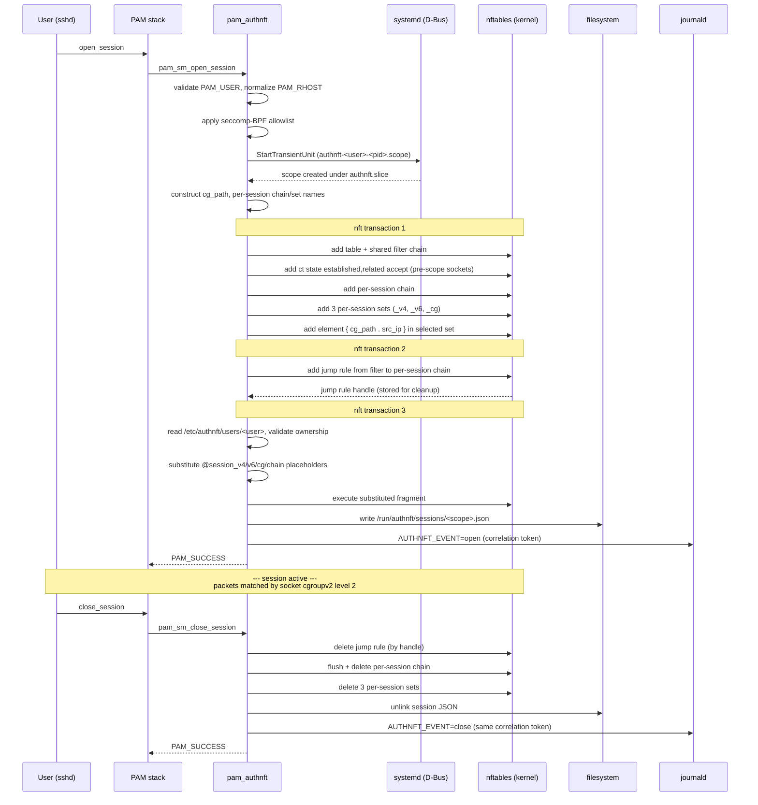

# pam_authnft

[](https://github.com/identd-ng/pam_authnft/actions/workflows/build.yml)
[](https://github.com/identd-ng/pam_authnft/actions/workflows/cifuzz.yml)
[](https://github.com/identd-ng/pam_authnft/actions/workflows/cppcheck.yml)
[](https://github.com/identd-ng/pam_authnft/actions/workflows/codeql.yml)
[](https://github.com/identd-ng/pam_authnft/actions/workflows/sanitizers.yml)
[](https://www.bestpractices.dev/projects/12496)
[](https://scan.coverity.com/projects/pam_authnft)
[](https://en.wikipedia.org/wiki/C_(programming_language))
[](LICENSE)

Linux has no built-in way to bind packet filter rules to an authenticated
user session and revoke them atomically at logout. pam_authnft fills that gap.

OpenBSD's pf has had this for years — named anchors loaded per-session via
pfctl, torn down when the session ends. pam_authnft brings the same model
to Linux: nftables named sets serve as the anchor equivalent, and the
cgroupv2 inode of a systemd transient scope replaces the authenticated shell
as the session identity. No dedicated shell, no setuid binary, no kernel
patches.

<p align="center">
  
</p>

> **Status: alpha (0.x.x).** The PAM interface (two exported symbols),
> nftables set schema, and fragment format are intended to be stable. The
> `claims_env` wire format, `rhost_policy=kernel` NETLINK details, and
> slice defaults may change before 1.0. See [Stability and
> roadmap](#stability-and-roadmap) below.

## Use cases

pam_authnft works with any PAM-enabled service. The scenarios where it
matters most:

- **SSH servers** — per-session firewall policy without wrapper scripts or
  ForceCommand hacks. A user's fragment can restrict outbound ports,
  pin allowed destinations, or enable masquerade only for that session.
  Filtering applies to sockets the user opens inside their session
  (listeners, outbound connections); the SSH control connection itself
  is handled by the `ct state established,related accept` rule the module
  adds to the shared filter chain ahead of session jumps. See
  [docs/ARCHITECTURE.txt](docs/ARCHITECTURE.txt) for the full trust model.
- **VPN concentrators** (WireGuard, OpenConnect, strongSwan) — per-tunnel
  packet filtering tied to the VPN's PAM authentication, not a static
  ruleset that applies to all tunnels.
- **Bastion / jump hosts** — auditable per-session network access. Each
  session element is visible in `nft list table inet authnft`
  with username, PID, and optional claims tag, plus a shared correlation
  token in the systemd journal for SIEM join.
- **RADIUS / TACACS+ and OIDC deployments** — the `claims_env` mechanism
  can carry AAA attributes or token-derived claims from an upstream PAM
  module into the nftables element comment, creating a traceable link
  between the authentication decision and the firewall rule.
- **Bastion hosts fronting containers** — users authenticate via PAM (SSH,
  OIDC), pam_authnft restricts which container IPs and ports that session
  can reach. The match works inside containers on kernels >= 6.12 (namespace-
  aware cgroupv2 offset). For policy enforcement *inside* Kubernetes pods
  (no PAM session), BPF cgroup programs are the natural path — see
  [docs/TODO.txt](docs/TODO.txt).

## How it works

The cgroupv2 filesystem assigns each cgroup directory a unique inode, stable
for the cgroup's lifetime. When systemd creates a transient `.scope` for
the session via D-Bus, all session processes land under that cgroup. The
module inserts `{ cgroup_path . src_ip }` into a named nftables set; the
kernel resolves the path to an inode at insert time via `socket cgroupv2
level 2`. At packet classification time, nftables reads the socket's
originating cgroup — the cgroup the socket was *created* in, not the cgroup
its owning task is currently in — and matches it against the set, binding
the firewall rule to the session without referencing PIDs, UIDs, or
usernames.

Session policy is inspectable with standard `nft` tooling
(`nft list table inet authnft`); no `bpftool` or BPF program inspection
required.

### Lifecycle at a glance



### Packet classification

When a packet enters the kernel, nftables walks the `filter` chain. The
first rule accepts established/related traffic (covering pre-scope
sockets like the SSH control connection itself). New connections jump
into a per-session chain; that chain's rules check the session's own
per-session set. Each session has its own chain and its own set — alice
and bob are matched by entirely different rules.

```text
   incoming packet
        │
        ▼
   ┌──────────────────────────────────┐
   │ chain filter                     │
   │ hook input, priority filter - 1  │
   ├──────────────────────────────────┤
   │ ct state established,related     │ ──▶ pre-scope sockets, accept
   │ jump session_alice_1127936       │ ──▶ alice's per-session chain
   │ jump session_bob_4321            │ ──▶ bob's per-session chain
   └─────────────────┬────────────────┘
                     │
                     ▼   (alice's session chain)
   ┌──────────────────────────────────┐         ┌──────────────────────────────────┐
   │ chain session_alice_1127936      │         │ set session_alice_1127936_v4     │
   ├──────────────────────────────────┤         ├──────────────────────────────────┤
   │ socket cgroupv2 level 2          │ lookup  │ { "authnft.slice/                │
   │   . ip saddr                     │ ──────▶│     authnft-alice-1127936        │
   │   @session_alice_1127936_v4      │         │     .scope" . 192.0.2.1 }        │
   │   accept                         │         └──────────────────────────────────┘
   │ (loaded from alice's fragment    │
   │  with @session_v4 placeholder    │
   │  substituted at open_session)    │
   └──────────────────────────────────┘

   key the set is matched on:
     socket's originating cgroup (set at socket creation)
     . packet source IP
```

Sessions are isolated from each other: alice's per-session chain only
ever references alice's per-session set, which contains exactly one
element (her cg_path . src_ip). Removing that element at close_session,
or deleting the per-session chain entirely, instantly stops her rules
from firing — bob's chain and set are untouched.

On session open:

1. Normalises `PAM_RHOST`: IPv4/IPv6 literals pass through, zone suffixes
   stripped, hostnames handled per `rhost_policy` (see [Module
   arguments](#module-arguments)).
2. Locks the PAM process with a seccomp-BPF allowlist (`SCMP_ACT_KILL`
   default).
3. Creates a named transient `.scope` under `authnft.slice` via D-Bus.
4. Constructs the scope's cgroupv2 path (`authnft.slice/<scope>.scope`) and
   stores it in PAM data alongside per-session chain/set names, the
   normalised source IP, and a correlation token.
5. Creates a per-session chain (`session_<user>_<pid>`) and three
   per-session sets (`_v4`, `_v6`, `_cg`). Inserts a session element
   into one set based on the resolved IP family. Adds a jump rule in the
   shared `filter` chain.
6. Validates and loads the user's root-owned fragment at
   `/etc/authnft/users/<username>`, substituting four placeholders
   (`@session_v4`, `@session_v6`, `@session_cg`, `@session_chain`)
   with the live per-session names.
7. Writes `/run/authnft/sessions/<scope_unit>.json` (0644 root:root) so
   unprivileged observers can correlate the cgroup back to the owning
   session — see [docs/INTEGRATIONS.txt](docs/INTEGRATIONS.txt) §5.6.
8. Emits a structured `AUTHNFT_EVENT=open` journal entry with the
   correlation token — see [docs/INTEGRATIONS.txt](docs/INTEGRATIONS.txt)
   §6.2.

On logout the stored session state is retrieved from PAM data: the jump rule
is deleted by handle, the per-session chain is flushed and deleted, and the
three per-session sets are deleted in a single transaction. The
session-identity JSON is unlinked and a matching `AUTHNFT_EVENT=close`
journal entry is emitted with the same correlation token. The shared
`filter` chain and `authnft` table persist across sessions.

For the full lifecycle, trust model, and seccomp details, see
[docs/ARCHITECTURE.txt](docs/ARCHITECTURE.txt).

## Integration surface

pam_authnft is deliberately small and composable. It exposes six stable
interfaces; the [integration contracts](docs/INTEGRATIONS.txt) document
each one with MUST/SHOULD requirements and versioning guarantees.

| Interface | What it is | Who cares |
|---|---|---|
| **PAM** | Exactly two exported symbols: `pam_sm_open_session`, `pam_sm_close_session`. Reads `PAM_USER`, `PAM_RHOST`, and optionally two env vars (`claims_env=NAME`, `AUTHNFT_CORRELATION`). | PAM module authors, distro packagers |
| **nftables sets** | Three per-session sets per active session (`session_<user>_<pid>_{v4,v6,cg}`) under `table inet authnft`, inspectable via `nft list`. | Firewall tooling, policy engines |
| **Per-user fragments** | Plain nftables syntax at `/etc/authnft/users/<user>`. May use `include` to compose shared group-level rules (§4.6). | Config management (Ansible/Salt/Puppet), identity brokers |
| **systemd** | Transient `.scope` units under `authnft.slice`. Discoverable via `systemctl list-units 'authnft-*.scope'`. All `systemd.resource-control(5)` directives available. | Orchestrators, resource-accounting tools |
| **claims_env** | Optional keyring-payload channel: an upstream PAM module writes a tag via `add_key(2)` + `pam_putenv(3)`; pam_authnft reads, sanitizes, and embeds it in the nftables element comment. | AAA/audit integrations, identity brokers |
| **Session JSON + journal events** | `/run/authnft/sessions/<scope_unit>.json` for observability (§5.6); `AUTHNFT_EVENT=open/close` journald records with a shared `AUTHNFT_CORRELATION` token (§6.2). | SIEM collectors, workload schedulers, operator dashboards |

The module is not a plugin host. There is no shared-library ABI, no
callback registry. Every contract uses an existing kernel or userspace
primitive (PAM env, kernel keyring, filesystem, D-Bus, netlink, journald)
with a narrow schema.

```mermaid
flowchart LR
    subgraph producers["Producers (write)"]
        IB[Identity broker<br/>OIDC PAM module]
        CM[Config management<br/>Ansible/Salt/Puppet]
        OPS[Operator]
    end

    subgraph kernel["Kernel + userspace primitives"]
        KR[Kernel keyring<br/>add_key/keyctl]
        FS[/etc/authnft/users/<br/>fragments]
        ENV[PAM env<br/>claims_env, AUTHNFT_CORRELATION]
    end

    subgraph authnft["pam_authnft"]
        OPEN[pam_sm_open_session]
        CLOSE[pam_sm_close_session]
    end

    subgraph sinks["Consumers (read)"]
        NFT[nftables sets<br/>nft list]
        JSON[/run/authnft/sessions/<br/>JSON files]
        JRNL[journald<br/>AUTHNFT_EVENT]
        SCOPE[systemd scopes<br/>systemctl]
    end

    subgraph audience["Who reads what"]
        FW[Firewall tooling]
        SIEM[SIEM / SOC]
        ORCH[Orchestrators]
    end

    IB -->|claims tag| KR
    IB -->|correlation token| ENV
    CM -->|writes| FS
    OPS -->|writes| FS

    KR --> OPEN
    FS --> OPEN
    ENV --> OPEN

    OPEN --> NFT
    OPEN --> JSON
    OPEN --> JRNL
    OPEN --> SCOPE

    CLOSE --> NFT
    CLOSE --> JRNL

    NFT --> FW
    JSON --> SIEM
    JRNL --> SIEM
    SCOPE --> ORCH
```

Producers (left) are independent of consumers (right). pam_authnft sits
in the middle with no shared library or callback registry — every arrow
is a documented kernel or userspace primitive.

## Quick start

### Requirements

- Linux kernel >= 5.10, cgroupv2 unified hierarchy
- systemd with D-Bus
- nftables >= 1.0.6 (`socket cgroupv2` expression requires kernel >= 4.10)
- Build: `gcc`, `make`, `pkg-config`
- Libraries: `libnftables`, `libseccomp`, `libsystemd`, `libcap`, `libaudit`, `pam`

### Build and install

```
make                # release build
make debug          # rebuild with -DDEBUG -g for stderr tracing
make man            # build pam_authnft(8) manpage (requires pandoc)
sudo make install   # installs pam_authnft.so, authnft.slice, tmpfiles.d
sudo make install-man
```

Installs the module to `/usr/lib/security/pam_authnft.so`, `authnft.slice`
to `/etc/systemd/system/`, and the tmpfiles.d snippet that creates
`/run/authnft/sessions/` at boot to `/usr/lib/tmpfiles.d/authnft.conf`.

### Minimal working configuration

```bash
# Create the authnft group (members are subject to session firewall rules)
sudo groupadd authnft

# Add a user to the group
sudo usermod -aG authnft alice

# Create a root-owned fragment for that user
sudo tee /etc/authnft/users/alice > /dev/null <<'EOF'
add rule inet authnft @session_chain socket cgroupv2 level 2 . ip saddr @session_v4 accept
EOF
sudo chmod 644 /etc/authnft/users/alice
```

Add to `/etc/pam.d/sshd` (after `pam_systemd.so`):
```
session  optional  pam_authnft.so
```

Group members without a valid fragment are denied at session open (logged to
syslog). Non-members pass through unaffected.

See `examples/examples_generator.sh -f` for port-restricted, masquerade, and
time-limited fragment variants.

## Configuration reference

### Module arguments

| Argument | Default | Effect |
|---|---|---|
| `rhost_policy=lax` | ✓ | Use PAM_RHOST if it parses as an IP, else fall back to cgroup-only set |
| `rhost_policy=strict` |  | Deny session when PAM_RHOST is not a parseable IP literal (pre-0.2 behaviour) |
| `rhost_policy=kernel` |  | Derive peer IP from the session process's own ESTABLISHED TCP socket via `NETLINK_SOCK_DIAG` (see `ss(8)`). Logs a warning on divergence with PAM_RHOST. Falls through to `lax` on lookup failure |
| `claims_env=NAME` |  | Read PAM env var `NAME` for a kernel-keyring serial; embed the sanitized keyed payload in the nftables element comment. See [docs/INTEGRATIONS.txt](docs/INTEGRATIONS.txt) §2 |
| `AUTHNFT_NO_SANDBOX=1` |  | Disable the seccomp sandbox. Debugging only |

### Kernel keyring handoff (claims_env)

When `claims_env=NAME` is set, an upstream PAM module that runs earlier
in the same session can pass session metadata to pam_authnft through the
Linux kernel keyring. The keyring is a kernel-managed key/value store
scoped to the login session — see `keyrings(7)`. It is not a file, a
socket, or shared memory: the kernel allocates the key, enforces the
permissions, and tears it down automatically when the session ends.

```mermaid
sequenceDiagram
    participant U as Upstream PAM module<br/>(producer)
    participant K as Kernel keyring
    participant E as PAM env
    participant A as pam_authnft<br/>(consumer)
    participant N as nftables

    Note over U,A: Both modules run in the same PAM session,<br/>producer earlier in the stack than consumer

    U->>K: add_key("user", "<desc>", payload, SESSION_KEYRING)
    K-->>U: serial number
    U->>K: keyctl(SET_TIMEOUT, serial, ttl)
    U->>K: keyctl(SETPERM, POSSESSOR view/read/search)
    U->>E: pam_putenv("NAME=<serial>")

    Note over K: claims live in kernel,<br/>UID-locked, TTL-bounded

    A->>E: pam_getenv("NAME")
    E-->>A: "<serial>"
    A->>K: keyctl(READ, serial)
    K-->>A: payload bytes
    A->>A: sanitize to [A-Za-z0-9_=,.:;/-]
    A->>N: insert element with claims as comment
```

The producer requirements (key type, permissions, payload format,
ordering of `SET_TIMEOUT` before `SETPERM`) are documented in
[docs/INTEGRATIONS.txt §2](docs/INTEGRATIONS.txt). pam_authnft treats the
payload as opaque printable ASCII — it does not parse structure, only
sanitizes and embeds. This keeps the contract narrow and lets any
producer (identity broker, AAA stack, custom module) participate without
shared code.

Why the keyring rather than a file or env var alone:

- **Lifetime managed by the kernel.** When the session ends, the keyring
  is destroyed and the claims disappear. No cleanup code needed.
- **UID-locked at the kernel level.** Other processes on the host cannot
  read another session's claims, even as root, without first acquiring
  the keyring (POSSESSOR check).
- **No filesystem footprint.** Nothing to write, sync, or unlink. No
  race conditions, no leftover state on crash.
- **Survives the sshd privsep fork.** Unlike shell env vars, kernel
  keys remain readable across the auth-worker → session-worker
  transition that happens inside sshd.

### PAM stack options

Option A — module checks group membership internally; non-members pass through:
```
session  optional  pam_authnft.so
```

Option B — PAM gates on group membership. Members without a valid fragment are
denied; non-members skip the module entirely:
```
session  [success=1 default=ignore]  pam_succeed_if.so  user notingroup authnft  quiet
session  required  pam_authnft.so
```

### Per-user fragments

Each group member needs `/etc/authnft/users/<username>`, owned by root and not
world-writable. Before loading, the module calls `stat(2)` on the fragment path
and rejects it unless `st_uid == 0` and the world-writable bit is clear — the
same trust model used by `/etc/nftables.conf` and sudoers includes. The
fragment is included at the top level and run as nftables commands.

A fragment may use nftables' `include` directive to pull in shared rules
from other files — for example, a group-level fragment under
`/etc/authnft/groups/` referenced by every user who belongs to that group.
libnftables resolves includes transitively. pam_authnft enforces ownership
and mode only on the top-level per-user fragment; the admin is responsible
for the permissions of every transitively included file. See
[docs/INTEGRATIONS.txt](docs/INTEGRATIONS.txt) §4.6 for the composition
pattern, security notes, and cycle-detection guidance.

### nftables state after session open

```
# nft list table inet authnft
table inet authnft {
    set session_alice_1127936_v4 {
        typeof socket cgroupv2 level 0 . ip saddr
        flags timeout
        elements = { "authnft.slice/authnft-alice-1127936.scope" . 192.0.2.1 timeout 1d expires 23h55m56s comment "alice (PID:1127936)" }
    }

    set session_alice_1127936_v6 {
        typeof socket cgroupv2 level 0 . ip6 saddr
        flags timeout
    }

    set session_alice_1127936_cg {
        typeof socket cgroupv2 level 0
        flags timeout
    }

    chain filter {
        type filter hook input priority filter - 1; policy accept;
        ct state established,related accept
        jump session_alice_1127936
    }

    chain session_alice_1127936 {
        socket cgroupv2 level 2 . ip saddr @session_alice_1127936_v4 accept
    }
}
```

Note: `nft list` canonicalises the set type to `level 0`; the rule
retains the configured `level 2`. This is expected nftables behaviour
— the level is a property of the rule expression, not the set type.

With `claims_env=NAME` set and a valid keyring entry produced by an earlier
module in the stack, the element comment is extended with the sanitized
payload:

```
elements = { "authnft.slice/authnft-alice-1127936.scope" . 192.0.2.1 timeout 1d comment "alice (PID:1127936) [audit-session:7f3e9a]" }
```

The quoted path is the session's cgroupv2 scope under `authnft.slice`. The
kernel resolves it to a cgroupv2 inode at insert time. At packet
classification time, `socket cgroupv2 level 2` reads the socket's
originating cgroup and matches it against the set — binding the firewall
rule to the session without referencing PIDs, UIDs, or usernames. The
24-hour timeout is a safety net; explicit deletion at logout is the primary
cleanup mechanism.

### Runtime observability (session JSON + audit events)

pam_authnft publishes session state through two complementary out-of-band
channels, in addition to the nftables state above:

- **`/run/authnft/sessions/<scope_unit>.json`** — a per-session JSON file
  (0644 root:root) written on open and removed on close, with a versioned
  schema (`v=2`) containing user, cgroup path, remote IP, fragment path,
  claims tag, scope unit, correlation token, and RFC 3339 open timestamp.
  Directory is created at boot by `/usr/lib/tmpfiles.d/authnft.conf`;
  orphans from failed close paths are reaped after 7 days. Full schema in
  [docs/INTEGRATIONS.txt](docs/INTEGRATIONS.txt) §5.6.

- **Structured journald audit events** — `AUTHNFT_EVENT=open` at session
  open and `AUTHNFT_EVENT=close` at close, both under
  `SYSLOG_IDENTIFIER=pam_authnft`, carrying a shared
  `AUTHNFT_CORRELATION` token that lets a SIEM join the two events (and,
  by convention, the upstream authentication event that produced the
  same token). Upstream PAM modules seed the correlation via
  `pam_putenv(pamh, "AUTHNFT_CORRELATION=<trace-id>")`. Full field
  schema in [docs/INTEGRATIONS.txt](docs/INTEGRATIONS.txt) §6.2.

Both sinks are fail-open: a write failure logs at LOG_WARNING but does not
deny the session.

### systemd controls

Because every session lands in a named `.scope` unit, the full systemd
resource control and sandboxing machinery is available — `man
systemd.resource-control(5)`. All settings in `data/authnft.slice` are
commented out; uncomment what you need.

**Outbound network policy** — enforced via systemd's cgroup-BPF integration,
orthogonal to nftables:
```ini
IPAddressDeny=any
IPAddressAllow=10.0.0.0/8
SocketBindDeny=ipv4:tcp:1-1023
SocketBindDeny=ipv6:tcp:1-1023
```

**Syscall and capability restriction** — applied to all processes in the
scope at creation:
```ini
SystemCallFilter=@system-service
SystemCallErrorNumber=EPERM
NoNewPrivileges=yes
CapabilityBoundingSet=
RestrictNamespaces=yes
```

## Testing

```
make test               # unit tests, no root needed
make test-integration   # pamtester + valgrind, requires root
```

Container workflows (recommended — no host mutation, requires `podman` only):
```
make test-container              # unit suite, 10 stages, CAP_NET_ADMIN
make test-integration-container  # pamtester end-to-end + valgrind
make trace-container             # seccomp allowlist trace
```

For the unit + integration stage matrix (stages 0–10 and 10.1–10.13)
and the CI gate inventory, see
[docs/CONTRIBUTING.txt](docs/CONTRIBUTING.txt) § Tests.

## Limitations

- cgroupv2 unified hierarchy only; hybrid setups untested.
- Hard systemd dependency; non-systemd init not supported.
- Fragment syntax errors are caught at load time and logged; semantic errors
  are the administrator's responsibility.
- If cleanup fails at logout (e.g., nftables unavailable), the set element
  expires after 24 hours via the safety-net timeout on insert. Session
  JSON orphans are reaped after 7 days by systemd-tmpfiles.
- The cgroup path is constructed deterministically from the scope unit name
  at `open_session`. The `socket cgroupv2` match applies to sockets created
  inside the session scope; sockets that existed before the scope was
  created (e.g., the SSH control connection) carry their original cgroup
  and are not matched. The module adds `ct state established,related
  accept` to the shared `filter` chain to handle pre-scope traffic.
- Transitively included fragments are NOT validated by pam_authnft for
  ownership or mode. The admin must ensure every included file is
  root-owned and not world-writable.

## Stability and roadmap

**Stable now** — the PAM interface (exactly two exported symbols), the three
nftables set types and their schemas, the fragment ownership model
(`st_uid == 0`, no world-writable), the element comment grammar documented
in [INTEGRATIONS.txt §6.1](docs/INTEGRATIONS.txt), the session-identity
JSON schema (`v=2`, §5.6), the structured journald audit fields (§6.2),
and the Linux audit-syscall channel
(`AUDIT_USER_ERR` with reason tags `missing | perms | content | nft-syntax`,
§6.2.7).

**May change before 1.0** — `claims_env` wire format details,
`rhost_policy=kernel` NETLINK internals, `authnft.slice` shipped defaults.

**Planned** — OSS-Fuzz registration (project files staged at
[infra/oss-fuzz/](infra/oss-fuzz/), submission gated on project age),
fragment linter (wraps libnftables dry-run), pluggable fragment
sources, packaging for Arch (AUR) and Debian. See
[docs/TODO.txt](docs/TODO.txt) for the full list.

## Contributing

Patches, testing on new distros/kernels, and integration experiments are
welcome. The areas where help is most wanted:

- **Packaging** — AUR, Debian, Fedora COPR, NixOS, Gentoo ebuilds
- **Distro and kernel testing** — especially non-Fedora systemd distros and
  kernels newer than 6.x
- **Integration prototypes** — if you maintain a PAM module, VPN daemon,
  or AAA stack and want to try the `claims_env` path, seed
  `AUTHNFT_CORRELATION` for audit joining, or drive fragment generation,
  open an issue describing the use case
- **Fuzzing** — libFuzzer harnesses for `util_is_valid_username`,
  `util_normalize_ip`, and nft fragment parsing
- **Documentation** — man page improvements, deployment guides, example
  fragments for common scenarios

Before opening a pull request, read
[docs/CONTRIBUTING.txt](docs/CONTRIBUTING.txt) — it documents the
invariants that must be preserved, the test stage matrix, the CI
gates a PR must clear, and the seccomp allowlist derivation
procedure.

Report security issues privately via [GitHub Security
Advisories](https://github.com/identd-ng/pam_authnft/security/advisories)
(see [SECURITY.md](SECURITY.md) for scope and expectations).

## Project documentation

| Document | Contents |
|---|---|
| [docs/ARCHITECTURE.txt](docs/ARCHITECTURE.txt) | Lifecycle, trust model, session identity, seccomp design, session-identity files, audit events |
| [docs/INTEGRATIONS.txt](docs/INTEGRATIONS.txt) | Stable contracts for producers and consumers: PAM stack (§1), claims_env keyring (§2), nft fragment composition (§4.6), systemd scopes (§5), session JSON (§5.6), structured journal events (§6.2), Linux audit-syscall events (§6.2.7) |
| [docs/CONTRIBUTING.txt](docs/CONTRIBUTING.txt) | Build, layout, invariants, style, test procedures, seccomp allowlist derivation |
| [docs/TODO.txt](docs/TODO.txt) | Near-term, medium-term, and deferred work items |
| [docs/DOC_CHECKLIST.txt](docs/DOC_CHECKLIST.txt) | Documentation update matrix by change type |
| [docs/THIRD_PARTY.md](docs/THIRD_PARTY.md) | Authoritative dependency inventory: licenses, version floors, security feeds |
| [docs/INCIDENT_RESPONSE.md](docs/INCIDENT_RESPONSE.md) | Internal runbook for handling a security report (the public policy is [SECURITY.md](SECURITY.md)) |
| [docs/SECURITY_PRACTICES.md](docs/SECURITY_PRACTICES.md) | Single-page overview of every security tool, doc, goal, and milestone in the project |
| [docs/REPRODUCIBLE_BUILDS.md](docs/REPRODUCIBLE_BUILDS.md) | What reproducibility we provide, what we don't, and how a packager verifies a release artefact |
| [SECURITY.md](SECURITY.md) | Vulnerability scope and reporting procedure |

## License

GPL-2.0-or-later.  See [LICENSE](LICENSE) for details.

Every source file carries an `SPDX-License-Identifier: GPL-2.0-or-later`
tag.  Recipients may redistribute and/or modify the software under the
terms of GPL-2.0, or, at their option, any later version published by
the Free Software Foundation.

Copyright (C) 2025-2026 Avinash H. Duduskar.
